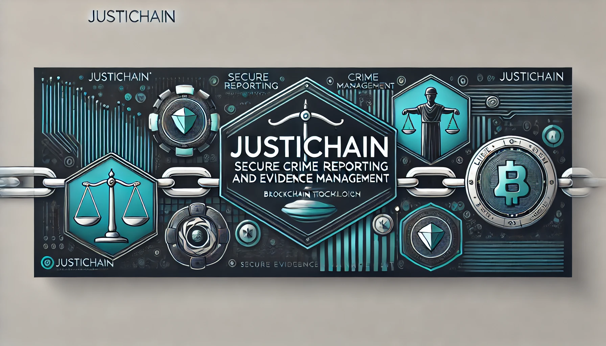

<h1 align="center"> JustiChain 🚀</h1>

  

## Table of Contents 📚

- [Table of Contents 📚](#table-of-contents-)
- [Introduction 🌟](#introduction-)
- [What is JustiChain? 🤔](#what-is-justichain-)
- [Features 🛠️](#features-️)
- [Purpose and Goals 🎯](#purpose-and-goals-)
- [Why Use JustiChain? 💡](#why-use-justichain-)
- [Future Enhancements 🔮](#future-enhancements-)
- [How JustiChain Works 🔄](#how-justichain-works-)
- [Community Involvement 🤝](#community-involvement-)
- [License 📄](#license-)

## Introduction 🌟

**JustiChain** is a secure, web-based platform that simplifies crime reporting and evidence management. Designed with both the public and law enforcement in mind, **JustiChain** guarantees the integrity of submitted evidence through advanced hashing and encryption methods. The platform fosters trust and transparency between communities and law enforcement by ensuring the confidentiality and security of all reports.

## What is JustiChain? 🤔

Imagine a super-secure digital suggestion box for crime reporting:

- 🕵️ Anonymous reporting
- 🔒 Tamper-proof evidence storage
- 👮 Efficient law enforcement access

**JustiChain** bridges the gap between citizens and authorities, ensuring justice without compromising safety.

## Features 🛠️

- **Anonymous Crime Reporting** 🕵️: Submit crime reports without exposing personal information, ensuring user safety and privacy.
- **Tamper-Proof Evidence** 🔒: Use cryptographic hashing and encryption to maintain the integrity of submitted evidence.
- **Law Enforcement Dashboard** 👮: A specialized interface for law enforcement to manage and verify crime reports efficiently.
- **User Feedback System** 📝: Allows users to provide feedback on their experience and suggest improvements.
- **Analytics & Reporting** 📊: Enable law enforcement to track and analyze crime data trends over time, improving community safety efforts.

## Purpose and Goals 🎯

The purpose of **JustiChain** is to create a secure and trustworthy platform where individuals can report crimes without fear. We're on a mission to create a safer world. Here's what we aim to do:

- Protect user anonymity and encourage more people to report crimes.
- Ensure that all submitted evidence remains tamper-proof.
- Provide law enforcement with a streamlined process for managing crime reports.
- Build a community centered around safety, justice, and accountability.
- Keep you safe by protecting your identity when you report crimes
- Make sure your evidence stays 100% accurate and untouched
- Help police solve crimes faster with organized, reliable information
- Build a community where everyone works together for justice and safety

## Why Use JustiChain? 💡

**JustiChain** offers numerous benefits for both the public and law enforcement:

- **For You** 🎭: Report safely, without fear
- **For Police** 🛡️: Access reliable, verified information
- **For Society** ⚡: Foster safer communities through collaboration
- **For Justice** 🤝: Maintain evidence integrity throughout investigations

## Future Enhancements 🔮

We're always dreaming big! Here's what's on our wish list:

- **Mobile App** 📱: On-the-go reporting
- **Community Crime Watch** 👥: Neighborhood safety networks
- **Real-Time Crime Alerts** 🚨: Instant local updates
- **Direct Line to Local Police** 🏛️: Faster response times

## How JustiChain Works 🔄

1. **You Witness** 👀: Observe a crime or gather crucial information
2. **You Report** 📝: Use our intuitive online form
3. **We Secure** 🔐: Apply state-of-the-art digital protection
4. **Police Investigate** 🔍: Law enforcement utilizes the secure data

## Community Involvement 🤝

Join our community of everyday heroes:

- **Be a Local Hero** 🚔: Contribute to neighborhood safety
- **Bridge the Gap** 👮‍♀️: Build trust with law enforcement
- **Stay Street Smart** 🛡️: Access and share safety tips

## License 📄

This project is licensed under the MIT License. See the [LICENSE](LICENSE) file for details.